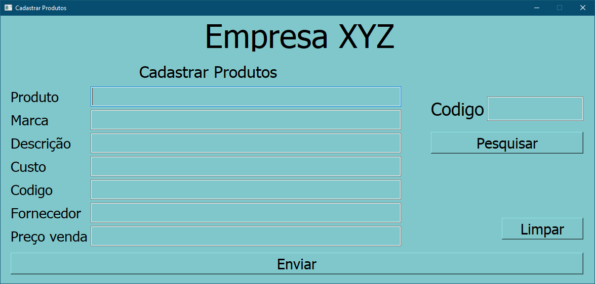

# Interface Cadastramento de produtos


## Descrição

Sistema para cadastrar produtos utilizando PySide2 + Qt5 e banco de dados SQLite.

## Funcionalidades

* Cadastrar Produtos
* Verificar Produtos cadastrados

## Instalando Pre Requisitos

```                                 
pip install -r requisitos.txt
```

## Executando

```
python janela.py
```

## Prints

