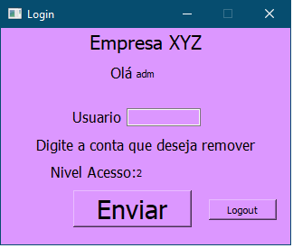

# Interface Login Simples


## Descrição

Sistema simples de login com PySide2 + Qt5 e banco de dados SQLite.

## Funcionalidades

* Login
* Cadastrar Usuario
* Redefinir Senha
* Deletar Usuario

## Instalando Pre Requisitos

```                                 
pip install -r requisitos.txt
```

## Executando

```
python janela.py
```

## Prints


